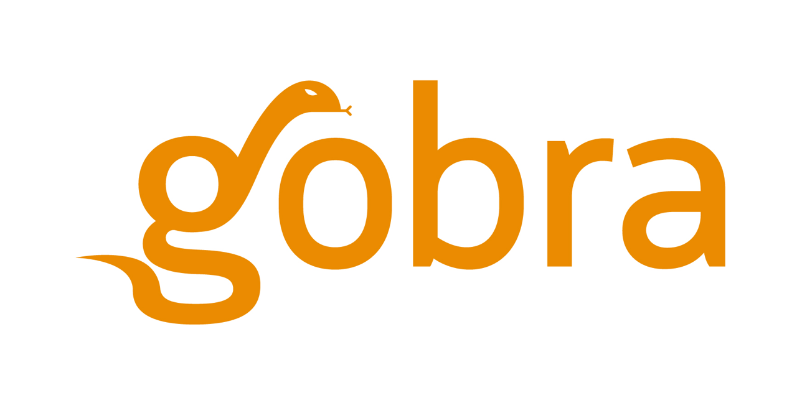

[Gobra](https://www.pm.inf.ethz.ch/research/gobra.html) is a prototype verifier for Go programs, based on the [Viper verification infrastructure](https://www.pm.inf.ethz.ch/research/viper.html).

We call annotated Go programs Gobra programs and use the file extension `.gobra` for them. A tutorial can be found in [`docs/tutorial.md`](https://github.com/viperproject/gobra/blob/master/docs/tutorial.md). More examples can be found in [`src/test/resources`](https://github.com/viperproject/gobra/blob/master/src/test/resources).

## Compile and Run Gobra
### Preliminaries
- Java 64-Bit (tested with version 11 and 15)
- SBT (tested with version 1.4.4)
- Git

### Installation
1. Install Z3 and Boogie.
    Steps (iii) and (iv) are specific to Boogie and only necessary when using Carbon as verification backend. Gobra uses the Silicon verification backend by default.
    1. Get a Z3 executable. A precompiled executable can be downloaded [here](https://github.com/Z3Prover/z3/releases).
      We tested version 4.8.7 64-Bit.
    2. Set the environment variable `Z3_EXE` to the path of your Z3 executable.
    3. Get a Boogie executable. Instructions for compilation are given [here](https://github.com/boogie-org/boogie).
        [Mono](https://www.mono-project.com/download/stable/) is required on Linux and macOS to run Boogie.
        Alternatively, extract a compiled version from the Viper release tools
        ([Windows](http://viper.ethz.ch/downloads/ViperToolsReleaseWin.zip), [Linux](http://viper.ethz.ch/downloads/ViperToolsReleaseLinux.zip), [macOS](http://viper.ethz.ch/downloads/ViperToolsReleaseMac.zip)).
    4. Set the environment variable `BOOGIE_EXE` to the path of your Boogie executable.
2. Clone `gobra` (this repository) in your computer.
3. Change directory to the `gobra` directory created in the previous step.
4. Run `git submodule update --init --recursive` to fetch `viperserver` and its transitive dependencies (`carbon`, `silicon` and `silver`).
5. Run `sbt compile` to compile Gobra.

The command `sbt assembly` can also be used to produce a fat jar file, which is located by default in `target/scala`.

### Running Gobra
Gobra can be run either from sbt or from a compiled jar:
- running from sbt:
    1. change directory to the `gobra` directory obtained from cloning this repository.
    2. run `sbt`.
    3. inside the sbt shell, run `run - i path/to/file` (e.g., `run -i src/test/resources/regressions/examples/swap.gobra`)
- running from a compiled jar:
    1. change directory to the `gobra` directory obtained from cloning this repository.
    2. run `sbt assembly`,
    3. to verify a file, run `java -jar -Xss128m path/to/gobra.jar -i path/to/file`.

More information about the available options in Gobra can be found by running `run --help` in an sbt shell or `java -jar path/to/gobra.jar --help` if you assembled Gobra.

### Running the Tests
In the `gobra` directory, run the command `sbt test`.

## Licensing
Most Gobra sources are licensed under the Mozilla Public License Version 2.0.
The [LICENSE](./LICENSE) lists the exceptions to this rule.
Note that source files (whenever possible) should list their license in a short header.
Continuous integration checks these file headers.
The same checks can be performed locally by running `npx github:viperproject/check-license-header#v1 check --config .github/license-check/config.json --strict` in this repository's root directory.

## Get in touch
Do you still have questions? Open an issue or contact us on [Zulip](https://gobra.zulipchat.com).
